# BDM-capstone-project-2025

# Strategic Analysis and Enhancement of Admission Dynamics at Aishwarya College 🎓


> **A Data-Driven Capstone Project by Daiwik Rankawat**  
> *Identifying a ₹1 Crore revenue leakage and formulating a strategic roadmap to reverse a 47% admission decline.*

---

## 📑 Table of Contents
1. [Executive Summary](#-executive-summary)
2. [Chapter 1: The Problem Landscape](#-chapter-1-the-problem-landscape)
3. [Chapter 2: Data Collection & Methodology](#-chapter-2-data-collection--methodology)
4. [Chapter 3: Key Insights & Revenue Analysis](#-chapter-3-key-insights--revenue-analysis)
5. [Chapter 4: Strategic Recommendations (The 3 Pillars)](#-chapter-4-strategic-recommendations-the-3-pillars)
6. [Chapter 5: Implementation Roadmap](#-chapter-5-implementation-roadmap)
7. [Conclusion](#-conclusion)

---

## 🚀 Executive Summary

Aishwarya College, established in 2018, faced a critical challenge: a **47% decline in admissions** over three years (2021-2023). This project involved a rigorous analysis of admission data to identify the root causes of this decline.

The analysis revealed a systemic issue of **"Stream Switching"**—where students admitted into high-fee Science programs migrated to lower-fee Arts/Commerce programs due to a lack of perceived value and academic support. This, combined with transportation bottlenecks and program saturation, led to an estimated **₹1 Crore revenue leakage**.

This repository contains the data analysis, findings, and a proposed **3-Pillar Strategy** to revitalize admissions and secure financial stability.

---

## 📉 Chapter 1: The Problem Landscape

The institution is facing a "Structural Growth Bottleneck." The decline is not merely due to market forces but internal misalignments between student expectations and college infrastructure.

### 1.1 Admission Trend Analysis
The total number of admissions dropped significantly from **408 in 2021** to **217 in 2023**.


### 1.2 The "Hidden Failure": Stream Switching
A major discovery was that **32.3%** of students abandon their original academic stream after Class 12.


### 1.3 Problem Hierarchy
Breaking down the core issues affecting the institution.


### 1.4 The Vicious Cycle
How the current situation feeds into itself.


---

## 📊 Chapter 2: Data Collection & Methodology

Data was collected from primary sources (admin logs) spanning three academic years. The raw data was cleaned, processed, and analyzed using Microsoft Excel.

### 2.1 Data Schema
The dataset comprises detailed student profiles.


### 2.2 Analysis Workflow
The step-by-step approach taken to derive insights.

```mermaid
graph TD
    %% --- NODES ---
    A([Raw Data Collection])
    B([Data Cleaning])
    C{Data Processing}
    D[Imputation]
    E[Normalization]
    F([Pivot Table Analysis])
    G([Trend Visualization])
    H{{Strategic Insights}}
    
    %% --- CONNECTIONS ---
    A ==> B
    B ==> C
    C -->|Fill Missing| D
    C -->|Standardize| E
    D --> F
    E --> F
    F ==> G
    G ==> H
    
    %% --- TOOLS SUBGRAPH ---
    subgraph Tools ["🛠️ Analysis Toolkit"]
        direction LR
        I[Excel Formulas]
        J[Pivot Charts]
        K[Staggered Histograms]
    end
    
    F -.-> Tools
    
    %% --- STYLING ---
    classDef start fill:#00b894,stroke:#fff,stroke-width:2px,color:#fff;
    classDef process fill:#0984e3,stroke:#fff,stroke-width:2px,color:#fff;
    classDef logic fill:#6c5ce7,stroke:#fff,stroke-width:2px,color:#fff;
    classDef endNode fill:#fdcb6e,stroke:#e17055,stroke-width:4px,color:#2d3436,font-weight:bold;
    classDef tool fill:#dfe6e9,stroke:#b2bec3,stroke-width:1px,color:#2d3436;

    class A,B start;
    class D,E,F,G process;
    class C logic;
    class H endNode;
    class I,J,K tool;
    
    style Tools fill:#f5f6fa,stroke:#b2bec3,stroke-width:2px,color:#2d3436
```



### 2.3 Variable Correlation Logic
We analyzed how different variables impacted the admission decision.


---

## 💡 Chapter 3: Key Insights & Revenue Analysis

The most critical finding of this project is the quantification of revenue loss due to academic misalignment.

### 3.1 The ₹1 Crore Revenue Leakage
Students moving from Science (High Fee) to Arts (Low Fee) caused massive financial damage.


### 3.2 Transport Infrastructure Gap
A major barrier to entry for students living >15km away.


### 3.3 Program Popularity vs. Market Trend
The disconnect between what the market wants and what students are choosing.


### 3.4 Gender Distribution Imbalance
Analysis of gender ratios across streams.


---

## 🎯 Chapter 4: Strategic Recommendations (The 3 Pillars)

To reverse the trend, a three-pronged strategy is proposed.

### 4.1 The Strategy Framework


### 4.2 Pillar 1: Academic Innovation (Stopping the Leak)
Preventing stream switching by making Science/Tech attractive.

```mermaid
sequenceDiagram
    autonumber
    
    %% --- ACTORS ---
    actor S as 🎓 Student
    participant C as 🧑‍💼 Counselor
    participant A as 🏛️ College Admin

    %% --- PHASE 1: INTAKE (Deep Blue) ---
    rect rgb(20, 30, 60)
        Note over S, A: 🟦 PHASE 1: INITIAL CONTACT
        S->>A: Applies for Admission
        A->>S: Schedules Mandatory Counseling
    end

    %% --- PHASE 2: INTERVENTION (Deep Orange/Brown) ---
    rect rgb(60, 30, 10)
        Note over S, C: 🟧 PHASE 2: STRATEGIC GUIDANCE
        C->>S: Explains Career Value of Science/Tech
        C->>S: Offers "Bridge Course" for Confidence
    end

    %% --- PHASE 3: SUCCESS (Deep Green) ---
    rect rgb(10, 50, 20)
        Note over S, A: 🟩 PHASE 3: CONVERSION
        S->>A: Enrolls in B.Sc / BCA (Retained Stream)
        Note right of A: 💰 HIGHER REVENUE SECURED
    end
```



### 4.3 Pillar 2: The Scholarship Funnel
Converting high-potential students using a merit-based approach.


### 4.4 Pillar 3: Infrastructure & Outreach
Addressing the physical barriers to entry.


---

## 📅 Chapter 5: Implementation Roadmap

A phased approach to executing the strategy over the next 12 months.

### 5.1 The Timeline (Gantt Chart)

```mermaid
gantt
    title 🚀 Strategic Implementation Roadmap (2024-2025)
    dateFormat  YYYY-MM-DD
    axisFormat  %b %y
    excludes    weekends

    section 🏗️ Phase 1: Foundation
    Form Task Force           :crit, a1, 2024-05-01, 30d
    Finalize New Curricula    :a2, after a1, 60d
    Design Scholarship Test   :crit, a3, after a1, 45d
    
    section ⚡ Phase 2: Execution
    Launch Marketing Campaign :active, b1, 2024-09-01, 90d
    Conduct Scholarship Tests :b2, after b1, 60d
    Secure Transport Contracts:active, b3, 2024-11-01, 60d
    
    section 📈 Phase 3: Optimization
    Launch New Programs       :c1, 2025-03-01, 120d
    Implement Data Dashboard  :crit, c2, 2025-06-01, 90d
    Final Review & Scale      :active, c3, 2025-10-01, 2025-12-31
```



### 5.2 The Virtuous Cycle of Growth
The expected outcome of implementing these strategies.


---

## ✅ Conclusion

The data has illuminated the path forward. By addressing the **₹1 Crore revenue leakage** through academic realignment and fixing the **transportation bottleneck**, Aishwarya College can convert its current challenges into a catalyst for future success.

**Key Outcomes Expected:**
1.  **Revenue Recovery:** Recapture lost revenue from stream switching.
2.  **Admission Growth:** Reverse the decline and aim for 400+ admissions.
3.  **Brand Positioning:** Establish a reputation for career-focused Science & Tech education.

---

## 📂 Repository Structure

```bash
├── Data/
│   ├── Raw_Admission_Data_2021_2023.xlsx
│   └── Processed_Analysis.csv
├── Reports/
│   ├── Project_Proposal.pdf
│   ├── Mid_Term_Report.pdf
│   └── Final_Capstone_Report.pdf
├── Presentation/
│   └── Strategic_Roadmap_Presentation.pdf
├── Visualizations/
│   ├── Revenue_Leakage_Chart.png
│   └── Stream_Switching_Sankey.png
└── README.md
```

---

## 👨‍💻 Author

**Daiwik Rankawat**  
*BS in Data Science and Applications, IIT Madras   -2027 (Graduate)*  
*B.Sc in Biology, JNVU -2023 (Graduate)*

[](https://www.linkedin.com/in/daiwik-rankawat/) 
[](https://github.com/daiwik-project)

